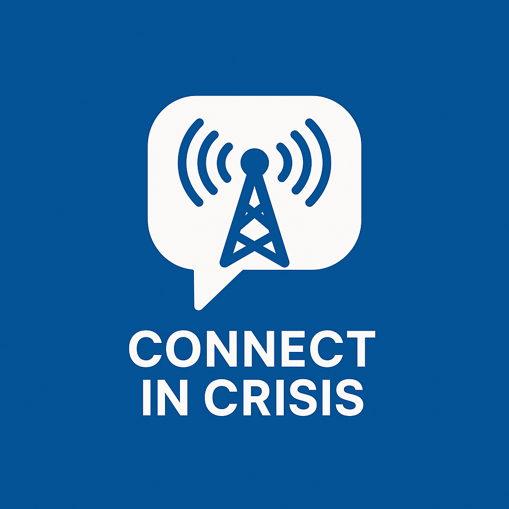

  

<header class="hero" style="text-align: center;">
  <h1>🛡️ Connect in Crisis</h1>
  
A secure communication guide for families, journalists, and activists during blackouts, shutdowns, or surveillance.

</header>

---

## 🌍 English

### 🧭 Purpose
To help people stay connected during a crisis — both those inside high-risk zones and those trying to reach them from outside. We know this information may reach you during very stressful times, so this guide is designed to be short, calm, and easy to use. Each step is practical and aimed at helping you feel more in control, even when things feel uncertain.

### 🛠️ Tier 1: Preparation (Before Shutdown)

#### 📊 App Summary
| App        | Mesh? | Offline? | Encryption | Best Use Case |
|------------|:-----:|:--------:|:----------:|----------------|
| **Bridgefy** | ✅ Bluetooth | ✅ | Moderate | Quick local messaging; not for sensitive info |
| **Briar**    | ✅ Bluetooth/Wi‑Fi | ✅ | Strong | Trusted local groups (Android only) |
| **Session**  | ❌ | ❌ | Very strong | Anonymous long-distance communication |
| **SimpleX**  | ❌ | ❌ | Strong | Decentralized private messaging |

Take a deep breath — you don’t have to do everything at once. These steps are here to support you and can be done one by one, with people you trust:

- Install apps like Bridgefy, Briar, Session, or SimpleX. They help you stay in touch even when the internet is down.
- Write down phone numbers and shared emoji codes (🟢 = safe, 🔴 = need help) on paper, in case your phone dies or is lost.
- Make two simple plans: one for talking with people *inside* your area, one for checking in with loved ones *outside*.
- Choose a time for check-ins (like 9 AM and 9 PM) so no one panics without updates.

### 📡 Tier 2: During Blackout

If the internet goes out completely, stay calm. These tools and ideas can help you reach others nearby or pass messages out:

- Use Bluetooth mesh (Bridgefy, Briar) to message people close to you — no Wi-Fi or cell needed.
- If one person has internet, they can pass updates for others. Send short messages clearly (e.g., 'Ali safe. Need water.').
- If you have tools like Gotenna or Meshtastic, use them. They’re great for group coverage.
- If you reach someone who’s online, ask them to relay info to families or friends outside the zone.

### 🧠 Privacy Tips
- Keep your phone with you and avoid letting it out of sight in public or shared spaces.
- Use apps that don’t require real names, phone numbers, or SIM cards — this adds a layer of safety.
- If using sensitive apps, hide them inside folders or use apps that allow disguise modes (like Briar).
- Keep conversations short and use shared emojis or phrases instead of long messages when possible.

---

## 🇮🇷 Farsi (فارسی)

### 🧭 هدف
برای کمک به افراد آسیب‌پذیر برای حفظ ارتباط در زمان قطع یا نظارت اینترنت — به‌ویژه در مناطق پرخطر.

### 🛠️ مرحله ۱: آمادگی قبل از قطع اینترنت
- نصب اپلیکیشن‌های امن مانند Bridgefy، Briar، Session، SimpleX. این اپ‌ها می‌توانند بدون اینترنت سنتی یا با ارتباط نظیر به نظیر کار کنند. آن‌ها را روی تمام گوشی‌های خانواده نصب کنید.
- یادداشت اطلاعات تماس و کدهای مشترک روی کاغذ. در صورت گم شدن یا ضبط گوشی، هنوز به اطلاعات حیاتی دسترسی دارید.
- تعیین علائم تصویری یا رمز برای وضعیت‌ها. از ایموجی ساده استفاده کنید مثل 🟢 = امن هستم، 🔴 = نیاز به کمک دارم.

### 📡 مرحله ۲: هنگام قطع اینترنت
- استفاده از شبکه بلوتوث (Bridgefy، Briar) در محدوده نزدیک. این ابزارها امکان ارسال پیام بدون اینترنت را فراهم می‌کنند.
- ارسال پیام از طریق افراد مورد اعتماد که دسترسی به اینترنت دارند.
- استفاده از ابزارهایی مثل Gotenna یا Meshtastic در صورت موجود بودن، برای برد بیشتر.

### 🧠 نکات حفظ حریم خصوصی
- گوشی را همیشه نزد خود نگه دارید و در فضاهای عمومی تنها نگذارید.
- از اپ‌هایی استفاده کنید که نیاز به نام واقعی یا سیم‌کارت ندارند.
- اپ‌های حساس را در پوشه‌ها مخفی کنید یا از حالت مخفی استفاده کنید.
- پیام‌های کوتاه و با ایموجی‌های مشترک ارسال کنید.- گوشی خود را همیشه نزد خود نگه دارید و در مکان‌های عمومی یا اشتراکی آن را رها نکنید.
- از اپ‌هایی استفاده کنید که نام واقعی یا شماره تلفن لازم ندارند.
- اپ‌های حساس را در پوشه پنهان قرار دهید یا از حالت مخفی آن‌ها استفاده کنید.
- پیام‌های کوتاه و رمزی با ایموجی ارسال کنید.- استفاده از دو گوشی: یکی عمومی و یکی برای ارتباط امن.
- عدم استفاده از شناسه واقعی در اپ‌های حساس.
- استفاده از اپ‌هایی با حالت مخفی یا نمادهای جعلی.

---

## 🇮🇱 Hebrew (עברית)

### 🧭 מטרה
לסייע לאנשים פגיעים להישאר מחוברים בזמן הפסקת אינטרנט או פיקוח, במיוחד באזורים מסוכנים.

### 🛠️ שלב 1: הכנה לפני ניתוק
- התקנת אפליקציות מאובטחות: Bridgefy, Briar, Session, SimpleX.
- גיבוי מידע אנשי קשר וסיסמאות על נייר.
- קביעת קודים/אימוג'ים לבדיקה תקופתית.

### 📡 שלב 2: במהלך ניתוק
- שימוש ברשת בלוטות' בטווח קרוב.
- העברת מסרים דרך אנשים אמינים שיש להם גישה לאינטרנט.
- שימוש בכלים כמו Gotenna או Meshtastic אם יש.

### 🧠 טיפים לפרטיות
- שמרו את הטלפון אתכם ואל תשאירו אותו לבד במקומות ציבוריים.
- השתמשו באפליקציות שלא דורשות שם אמיתי או כרטיס SIM.
- החביאו אפליקציות רגישות בתיקיות או הפעילו מצב הסוואה.
- שלחו הודעות קצרות עם אימוג'ים מוסכמים מראש.- שמרו את הטלפון איתכם תמיד, במיוחד במרחבים ציבוריים או משותפים.
- העדיפו אפליקציות שאינן דורשות שם אמיתי או מספר טלפון.
- הסתירו אפליקציות רגישות בתיקיות או השתמשו במצב הסוואה.
- שלחו הודעות קצרות תוך שימוש באימוג'ים מוסכמים מראש.- שימוש בשני טלפונים: אחד פתוח ואחד מאובטח.
- לא להשתמש בפרטים אמיתיים בכלים רגישים.
- שימוש באפליקציות עם מצב נסתר או מסיכה.

---

## 🇸🇾 Arabic (العربية)

### 🧭 الهدف
مساعدة الأشخاص المعرضين للخطر في البقاء على اتصال أثناء انقطاع الإنترنت أو عند المراقبة، خصوصاً في المناطق الحساسة.

### 🛠️ المرحلة 1: التحضير قبل الانقطاع
- تثبيت تطبيقات آمنة مثل Bridgefy، Briar، Session، SimpleX.
- حفظ أرقام التواصل والرموز السرية ورقيًا.
- تحديد إشارات أو رموز تعبيرية للتحقق من السلامة.

### 📡 المرحلة 2: أثناء الانقطاع
- استخدام شبكات البلوتوث للمسافات القصيرة.
- نقل الرسائل عبر أشخاص موثوقين لديهم إنترنت.
- استخدام أدوات مثل Gotenna أو Meshtastic عند التوفر.

### 🧠 نصائح الخصوصية
- احتفظ بهاتفك معك دائمًا ولا تتركه في الأماكن العامة.
- استخدم تطبيقات لا تطلب الاسم الحقيقي أو شريحة SIM.
- أخفِ التطبيقات الحساسة داخل مجلدات أو استخدم الوضع المخفي.
- استخدم رسائل قصيرة مع رموز تعبيرية متفق عليها.- احتفظ بهاتفك معك دائماً ولا تتركه في الأماكن العامة أو المشتركة.
- استخدم تطبيقات لا تتطلب الاسم الحقيقي أو رقم الهاتف.
- أخفِ التطبيقات الحساسة داخل مجلدات أو فعّل وضع التخفي.
- استخدم رموزاً تعبيرية أو إشارات مختصرة عند إرسال الرسائل.- استخدام هاتفين: واحد عادي وواحد آمن.
- عدم تسجيل معلوماتك الحقيقية في التطبيقات الحساسة.
- استخدام تطبيقات بوضع التخفي أو التمويه.

---

## 🇹🇷 Turkish (Türkçe)

### 🧭 Amaç
İnternetin kapatıldığı veya gözetlendiği durumlarda özellikle yüksek riskli bölgelerde insanların bağlantıda kalmalarına yardımcı olmak.

### 🛠️ Aşama 1: Kapatma Öncesi Hazırlık
- Güvenli uygulamaları kurun: Bridgefy, Briar, Session, SimpleX.
- Kişi bilgilerini ve kodları kağıda yedekleyin.
- Durum bildirimleri için emoji/kod sistemi belirleyin.

### 📡 Aşama 2: Kesinti Sırasında
- Kısa mesafe Bluetooth ağı kullanın (Bridgefy, Briar).
- İnternete erişimi olan güvendiğiniz kişiler aracılığıyla mesaj iletin.
- Gotenna veya Meshtastic gibi araçları kullanın (varsa).

### 🧠 Gizlilik İpuçları
- Telefonunuzu yanınızda tutun, özellikle ortak alanlarda yalnız bırakmayın.
- Gerçek ad veya SIM istemeyen uygulamaları kullanın.
- Hassas uygulamaları klasörlere gizleyin veya gizli mod kullanın.
- Ortaklaşa belirlenen emojilerle kısa mesajlar gönderin.- Telefonunuzu yanınızdan ayırmayın, özellikle ortak alanlarda.
- Gerçek adınızı veya telefon numaranızı istemeyen uygulamaları tercih edin.
- Hassas uygulamaları klasörlere gizleyin ya da gizli modları kullanın.
- Kısa mesajlar ve önceden anlaşılan emojilerle iletişim kurun.- İki telefon kullanın: biri genel, biri güvenli.
- Gerçek kimlik bilgilerinizi hassas uygulamalarda kullanmayın.
- Gizli mod veya kamuflaj sağlayan uygulamalar tercih edin.

---

## 🌐 Contribute or Translate
Want to translate this guide further, share updates, or localize it for your region? [Open an issue](https://github.com/YOUR_USERNAME/connect-in-crisis/issues) or submit a pull request. We welcome your contributions.

---

<footer>
  
<small>Made with care, not fear. This page is open-source under the MIT License.</small>

</footer>

